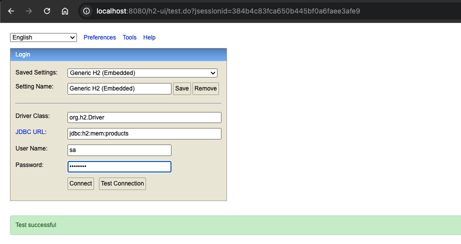

# Spring Boot 3.4.* product-service
###### Author: Orlando Villegas 2024
This tutorial is about a Spring Boot 3.4.* based microservice. This time, we are going to create a simple "CRUD" microservice that will allow us to manage a database "product" table upon a Rest Controller that will contain Create, Read, Update, and Delete endpoints. We will also add a List operation with pagination, sorting, and filtering features.
## Concept definitions
Before starting, we need to define a few concepts to have a clear background about the things that we will work on within this project.
### Microservices
A microservice is an architectural style that structures an application as a collection of small, autonomous, and loosely coupled services. Each microservice focuses on a specific business capability, operates independently, and communicates with other services through lightweight protocols such as HTTP or messaging queues. This approach enhances scalability, maintainability, and agility in software development.
### C.R.U.D.
CRUD stands for Create, Read, Update, and Delete, which are the four basic operations performed on data in a database or persistent storage.

- Create: Adding new data (e.g., inserting a new record).
- Read: Retrieving or querying existing data.
- Update: Modifying existing data.
- Delete: Removing data.

These operations form the foundation of most software systems that handle data management.
### Rest Controller
A REST Controller is a component in a web application that handles HTTP requests and provides responses in a RESTful web service. In frameworks like Spring Boot, it is typically defined using the @RestController annotation.

It simplifies development by combining the functionality of @Controller and @ResponseBody, allowing methods to return data directly as JSON or XML without the need for view templates. REST Controllers are commonly used to expose APIs for creating, reading, updating, and deleting resources.
### Services
@Service is an annotation in Spring Framework used to mark a class as a service layer component. It indicates that the class contains business logic and acts as an intermediary between the controller and repository layers in a Spring application.

By using @Service, the class is automatically detected and registered as a Spring bean, enabling dependency injection and making it easier to manage and test the application's business logic.
### Repositories
@Repository is an annotation in the Spring Framework used to indicate that a class is responsible for interacting with the database. It marks the class as a data access layer component.

Key features of @Repository:
- It enables automatic detection and registration as a Spring bean.
- It translates database-related exceptions into Spring's unified exception hierarchy, making exception handling consistent and manageable.

Classes annotated with @Repository typically include methods for CRUD operations and custom queries.

## Building an Application with Spring Boot
If you want to create your own Spring Boot-based project, visit <a href="https://start.spring.io" target="_blank">Spring Initializr</a>, fill in your project details, pick your options, and download a bundled up project as a zip file.
### Product Service Project Conf
Open the Spring Initializr and configure a new project as follows
<figure>
    
    <figcaption>Spring Boot Project configuration used in this tutorial.</figcaption>
</figure>

Download and unzip the project in your computer
<figure>
    
    <figcaption>Spring Boot Project should be unzipped and after loaded in your IDE.</figcaption>
</figure>

Load your project into your preferred IDE (I'm using <a href="https://www.jetbrains.com/es-es/idea/download/other.html" target="_blank">IntelliJ Idea CE</a>),
download and unzip the project in your computer.
<figure>
    
    <figcaption>After loading the project we will be ready to start or configuration process.</figcaption>
</figure>

## Project configuration
From now on we will begin to configure the starters (plug-ins) that we added when creating our project. I want to emphasize that we will not go into specific details of each plugin, but rather we will try to focus on its specific configuration for this project; I recommend that if you want to know more about all the plugins and their configurations, do a search on sites like baeldung.com, which compiles high-quality related material that can be very useful.
### H2 Database
H2 is a lightweight, open-source, in-memory relational database written in Java. It is commonly used for development, testing, and small-scale applications due to its simplicity and fast performance.
Key features of H2 include:
- Embedded and server modes: Can run as an in-memory database or as a standalone server.
- SQL support: Fully compatible with the SQL standard.
- Ease of use: Requires minimal configuration.

H2 is popular in Spring Boot applications for testing because it integrates seamlessly and resets with each application restart.

#### Datasource configuration
In your project open `/product-service/src/main/resources/application.properties` and add the following:
```properties
spring.application.name=product-service

#Spring datasource
spring.datasource.url=jdbc:h2:mem:products
spring.datasource.driverClassName=org.h2.Driver
spring.datasource.username=sa
spring.datasource.password=password

#JPA
spring.jpa.show-sql=true
spring.jpa.properties.hibernate.dialect=org.hibernate.dialect.H2Dialect
spring.jpa.hibernate.ddl-auto=create-drop
spring.jpa.defer-datasource-initialization=true

#H2 DB
spring.h2.console.enabled=true
spring.h2.console.path=/h2-ui
```
Run your application and open a web browser, let's test the H2 console by going to `http://localhost:8080/h2-ui`, once the console login form is loaded, use your credentials defined in the `#Spring datasource` section of your `application.properties` file and test if you have access.
<figure>
    
    <figcaption>After clicking the "Test Connection" button you should see a green "Test successful" message.</figcaption>
</figure>

Click connect, and you should be redirected to the H2 DB console like this.
<figure>
    
    <figcaption>In this page you will be able to run SQL queries verify your table structure, etc.</figcaption>
</figure>

### Database Initialization
After configuring the H2 Database in our project, we should be able to load data into the database by following the <a href="https://docs.spring.io/spring-boot/how-to/data-initialization.html" target="_blank">documentation</a>, which says that we are able to load data into our DB on project start by setting spring.jpa.hibernate.ddl-auto to control Hibernate’s database initialization. Supported values are none, validate, update, create, and create-drop.

In addition, a file named data.sql in the root of the classpath (`src/main/resources/data.sql`) is executed on startup if Hibernate creates the schema from scratch (that is, if the ddl-auto property is set to create or create-drop).

```sql
DROP TABLE if EXISTS products CASCADE;
DROP sequence if EXISTS products_seq;
CREATE sequence products_seq start WITH 1 increment by 50;
CREATE TABLE products (price float(53), tax_rate float(53), id bigint NOT NULL, description varchar(255), name varchar(255), sku varchar(255) UNIQUE, PRIMARY KEY (id));

INSERT INTO products (sku,name,description,price,tax_rate)
VALUES
  (5223,'#ea9c9a','purus mauris a nunc. In at pede. Cras vulputate velit',34,3),
  (8192,'#70eace','NULLam feugiat placerat velit. Quisque varius. Nam porttitor',39,2),
  (5050,'#f7f25b','Fusce aliquet magna a neque. NULLam ut',103,6);
```

Run the application again, connect to the H2 DB console, you should see a new table called `products`, click on it and run the query
<figure>
    
    <figcaption>After run the query you will see a result list with the data inserted in the database.</figcaption>
</figure>

## Microservice structure
The structure of a __Spring Boot microservice__ typically follows a modular and layered architecture, focusing on scalability, maintainability, and separation of concerns. The key components include:

1. __Controller Layer:__ Handles incoming HTTP requests, routes them to the appropriate service, and returns responses (annotated with @RestController).

2. __Service Layer:__ Contains business logic and acts as an intermediary between the controller and repository layers (annotated with @Service).

3. __Repository Layer:__ Manages data persistence, providing CRUD operations and database interactions (annotated with @Repository).

4. __Model:__ Represents the application's domain data, often mapped to database tables using JPA annotations like @Entity.

5. __Configuration:__ Handles application-specific configurations, such as database connections, security, and external integrations (e.g., application.yml or application.properties).

6. __API Gateway (Optional):__ Manages routing, load balancing, and authentication for multiple microservices.

7. __External Communication:__ Utilizes REST APIs, messaging systems (like RabbitMQ or Kafka), or service discovery (like Eureka) to interact with other microservices.

Each microservice is self-contained, has its own database (in a typical design), and communicates with others via lightweight protocols like HTTP or messaging.

### Model
In Spring Boot, a model is a class that represents the application's data or domain objects. It is typically used to encapsulate data that will be processed, stored, or transferred between different layers of the application (e.g., Controller, Service, and Repository).

Key features of a Spring Boot model:

- Contains fields that represent the attributes of the data.
- May include getters, setters, constructors, and other utility methods.
- Often annotated with JPA annotations (e.g., @Entity, @Table, @Id) if it maps to a database table.

Models are central to defining the structure of data and facilitating communication within the application.
#### Product.java
We need to create our model which will contain our database table representation in java in this path `src/main/java/com/example/product/models/Product.java`.

```java
package com.example.product.models;

import jakarta.persistence.Column;
import jakarta.persistence.Entity;
import jakarta.persistence.GeneratedValue;
import jakarta.persistence.GenerationType;
import jakarta.persistence.Id;
import jakarta.persistence.Table;
import lombok.Data;

@Data
@Entity
@Table(name = "products")
public class Product {
  @Id
  @Column(name = "id")
  @GeneratedValue(strategy = GenerationType.IDENTITY)
  private long id;
  @Column(name = "sku", unique = true)
  private String sku;
  @Column(name = "name")
  private String name;
  @Column(name = "description")
  private String description;
  @Column(name = "price")
  private double price;
  @Column(name = "tax_rate")
  private double taxRate;
}
```
Now we can remove some configurations because the table creation process will be handled by the spring boot lifecycle and this configuration is no longer needed. In the `data.sql` we will comment the following:
```sql
--DROP TABLE if EXISTS products CASCADE;
--DROP sequence if EXISTS products_seq;
--CREATE sequence products_seq start WITH 1 increment by 50;
--CREATE TABLE products (price float(53), tax_rate float(53), id bigint NOT NULL, description varchar(255), name varchar(255), sku varchar(255) UNIQUE, PRIMARY KEY (id));
```
### Controller
A __Spring Boot Controller__ is a component in a Spring Boot application that handles incoming HTTP requests and defines the application's routing and request handling logic. It is typically annotated with @Controller or @RestController.

- __@Controller__: Used for traditional web applications, returning view templates like HTML.
- __@RestController__: A specialization of @Controller that combines @Controller and @ResponseBody, directly returning __JSON__ or __XML__ responses.

Controllers process user requests, invoke business logic (usually via services), and return responses to the client.

#### ProductController.java
We need to create a new file inside a new package called "controllers", this results in something like this. `src/main/java/com/example/product/controllers/ProductController.java`.
This si the first content of that file:

```java
package com.example.product.controllers;

public class ProductController {
}
```
After this point we need to add some __Spring Boot annotations__ to add the controller behavior this newly created class as follows

```java
package com.example.product.controllers;

import org.springframework.http.HttpStatus;
import org.springframework.web.bind.annotation.GetMapping;
import org.springframework.web.bind.annotation.RequestMapping;
import org.springframework.web.bind.annotation.ResponseStatus;
import org.springframework.web.bind.annotation.RestController;

@RestController
@RequestMapping(path = "/v1/product")
public class ProductController {

  @GetMapping
  @ResponseStatus(HttpStatus.ACCEPTED)
  public String read() {
    return "It works!";
  }
}
```
Run your application again and test this url `http://localhost:8080/v1/product`, we should get something like this
<figure>
    
    <figcaption>Response from the controller.</figcaption>
</figure>

If our controller was able to show us the result, we are now ready to add the missing methods to complete the structure of a CRUD + L list function.

#### Controller with the Model
Now our controller should be like this:

```java
package com.example.product.controllers;

import com.example.product.models.Product;
import jakarta.validation.Valid;
import org.springframework.http.HttpStatus;
import org.springframework.http.ResponseEntity;
import org.springframework.lang.NonNull;
import org.springframework.validation.annotation.Validated;
import org.springframework.web.bind.annotation.*;

import java.util.List;

@RestController
@Validated
@RequestMapping(path = "/v1/product")
public class ProductController {

  @GetMapping(path = "/list")
  @ResponseStatus(HttpStatus.ACCEPTED)
  public ResponseEntity<List<Product>> list() {
    return ResponseEntity.ok(List.of(new Product()));
  }

  @GetMapping(path = "/{id}")
  @ResponseStatus(HttpStatus.ACCEPTED)
  public ResponseEntity<Product> read(@PathVariable(required = true) long id) {
    return ResponseEntity.ok(new Product());
  }

  @PostMapping
  @ResponseStatus(HttpStatus.CREATED)
  public ResponseEntity<Product> create(@RequestBody(required = true) @NonNull @Valid Product product) {
    return ResponseEntity.ok(new Product());
  }

  @PutMapping(path = "/{id}")
  @ResponseStatus(HttpStatus.ACCEPTED)
  public ResponseEntity<Product> update(@PathVariable(required = true) long id, @RequestBody(required = true) Product product) {
    return ResponseEntity.ok(new Product());
  }

  @DeleteMapping(path = "/{id}")
  @ResponseStatus(HttpStatus.NO_CONTENT)
  public ResponseEntity<Void> delete(@PathVariable(required = true) long id) {
    return ResponseEntity.noContent().build();
  }

}

```
To reinforce the knowledge about them and add them to the endless tools that Java and Spring Boot provide us to build robust and efficient applications.
This a list of the most important ones
- Spring Web
  - `@RequestMapping`
  - `@GetMapping`
  - `@PostMapping`
  - `@PutMapping`
  - `@DeleteMapping`
  - `@ResponseStatus`
  - `@PathVariable`
- Spring Data
  - `@Entity`
  - `@Table`
  - `@Id`
  - `@Column`
  - `@GeneratedValue`
- Lombok
  - `@Data`

### Service
In an application, the business logic resides within the service layer so we use the __@Service Annotation__ to indicate that a class belongs to that layer. It is also a specialization of __@Component Annotation__ like the __@Repository Annotation__. One most important thing about the __@Service Annotation__ is it can be applied only to classes. It is used to mark the class as a service provider. So overall __@Service annotation__ is used with classes that provide some business functionalities.
#### ProductService.java
We need to create a new file inside a new package called "services", this results in something like this. `src/main/java/com/example/product/services/ProductService.java`. 
Now our service should be like this:

```java
package com.example.product.services;

import com.example.product.models.Product;
import org.springframework.stereotype.Service;

import java.util.List;

@Service
public class ProductService {

  public List<Product> all() {
    return List.of(new Product());
  }

  public Product get(final long id) {
    return new Product();
  }

  public Product save(final Product product) {
    return new Product();
  }

  public Product update(final long id, final Product product) {
    return new Product();
  }

  public void delete(final long id) {

  }
}
```
Now we need to change a couple of things in our `ProductController.java` file.
```java
@RestController
@Validated
@RequestMapping(path = "/v1/product")
public class ProductController {

    @Autowired
    private ProductService productService;//We need to inject the services
  //...
}
```
We need to perform the dependency injection process using the @Autowired annotation to create an instance of our newly created service and inject it into the product controller, but since we are using the Lombok library in our project, we can get rid of the @Autowired annotation leveraging the Lombok power of complete code and its dependencies behind the scene.
```java
@Data//This annotation will create the boilerplate code for us
@Validated
@RestController
@RequestMapping(path = "/v1/product")
public class ProductController {
    
    /* Since we are marking this property as final, Lombok will try to satisfy
     * the dependency creating an instance of the services and inject it before
     * instantiate the controllers. 
     */
    private final ProductService productService;
}
```
Now our controller should look like.

```java
package com.example.product.controllers;

import com.example.product.models.Product;
import com.example.product.services.ProductService;
import jakarta.validation.Valid;
import lombok.Data;
import org.springframework.http.HttpStatus;
import org.springframework.http.ResponseEntity;
import org.springframework.lang.NonNull;
import org.springframework.validation.annotation.Validated;
import org.springframework.web.bind.annotation.*;

import java.util.List;

@Data
@Validated
@RestController
@RequestMapping(path = "/v1/product")
public class ProductController {

  private final ProductService productService;

  @GetMapping(path = "/list")
  @ResponseStatus(HttpStatus.ACCEPTED)
  public ResponseEntity<List<Product>> list() {
    return ResponseEntity.ok(productService.all());
  }

  @GetMapping(path = "/{id}")
  @ResponseStatus(HttpStatus.ACCEPTED)
  public ResponseEntity<Product> read(@PathVariable(required = true) long id) {
    return ResponseEntity.ok(productService.get(id));
  }

  @PostMapping
  @ResponseStatus(HttpStatus.CREATED)
  public ResponseEntity<Product> create(@RequestBody(required = true) @NonNull @Valid Product product) {
    return ResponseEntity.ok(productService.save(productService.save(product)));
  }

  @PutMapping(path = "/{id}")
  @ResponseStatus(HttpStatus.ACCEPTED)
  public ResponseEntity<Product> update(@PathVariable(required = true) long id, @RequestBody(required = true) Product product) {
    return ResponseEntity.ok(productService.update(id, product));
  }

  @DeleteMapping(path = "/{id}")
  @ResponseStatus(HttpStatus.NO_CONTENT)
  public ResponseEntity<Void> delete(@PathVariable(required = true) long id) {
    productService.delete(id);
    return ResponseEntity.noContent().build();
  }

}
```
### Repository
__Spring @Repository annotation__ is a specialization of __@Component annotation__, so Spring Repository classes are auto-detected by __spring framework__ through classpath scanning. Spring Repository is very close to __DAO__ pattern where __DAO__ classes are responsible for providing __CRUD__ operations on database tables.
#### ProductRepository.java
We need to create a new file inside a new package called "repositories", this results in something like this. `src/main/java/com/example/product/repositories/ProductRepository.java`.
Now our repository should be like this:

```java
package com.example.product.repositories;

import com.example.product.models.Product;
import org.springframework.data.repository.CrudRepository;
import org.springframework.stereotype.Repository;

@Repository
public interface ProductRepository extends CrudRepository<Product, Long> {
}

```
In the same way that we did with the service and the controller, we have to link the new repository to the service by using dependency injection, and as we already know we can use Lombok for this.
Now our `ProductService.java` should look like:

```java
package com.example.product.services;

import com.example.product.models.Product;
import com.example.product.repositories.ProductRepository;
import lombok.Data;
import org.springframework.stereotype.Service;

import java.util.List;
import java.util.stream.StreamSupport;

@Data
@Service
public class ProductService {

  private final ProductRepository productRepository;

  public List<Product> all() {
    return StreamSupport.stream(productRepository.findAll().spliterator(), false).toList();
  }

  public Product get(final long id) {
    return productRepository.findById(id).orElseThrow();
  }

  public Product save(final Product product) {
    return productRepository.save(product);
  }

  public Product update(final long id, final Product product) {
    return productRepository.findById(id).map(existing -> {
      product.setId(existing.getId());
      return productRepository.save(product);
    }).orElseThrow();
  }

  public void delete(final long id) {
    productRepository.deleteById(id);
  }
}

```
### Testing our service
Once we've finished, we need to start our service and test this URL `http://localhost:8080/v1/product/list`, if we did everything correctly we should see something like this:
<figure>
    
    <figcaption>List of records from the DB</figcaption>
</figure>
We can verify the existing data in the DB console
<figure>
    
    <figcaption>After run the query you will see a result list with the data inserted in the database.</figcaption>
</figure>

#### Postman
Postman is a software application that allows developers to test, document, and share APIs (Application Programming Interfaces).
You can get it from <a href="https://www.postman.com/" target="_blank">here.</a>

Let's create a collection, first of all, install postman on your computer, create an account (optional), I will recommend using an account to save your workspace in the postman cloud.
<figure>
    
    <figcaption>Click on your app.</figcaption>
</figure>
<figure>
    
    <figcaption>Login.</figcaption>
</figure>
<figure>
    
    <figcaption>Select API development, and click next.</figcaption>
</figure>
<figure>
    
    <figcaption>Configure it, and click next.</figcaption>
</figure>
<figure>
    
    <figcaption>Congratulations you have a new postman workspace configured.</figcaption>
</figure>

#### Environment variables
Variables enable you to store and reuse values in Postman. By storing a value as a variable, you can reference it throughout your collections, environments, requests, and scripts. Variables help you work efficiently, collaborate with teammates, and set up dynamic workflows.

For example, if you have the same URL in more than one request, but the URL might change, you can store it in a variable called `base_url`. Then, reference the variable in your requests using `{{base_url}}`. If the URL changes, you can change the variable value, and it will be reflected throughout your collection, wherever you've used the variable name.

The same principle applies to any part of your request where data is repeated. Whatever value is stored in the variable will be included wherever you've referenced the variable when your requests run. If the base URL value is `https://postman-echo.com`, and is listed as part of the request URL using `{{base_url}}/get`, Postman will send the request to `https://postman-echo.com/get`.

<figure>
    
    <figcaption>Example of how to create variables in postman.</figcaption>
</figure>

<figure>
    
    <figcaption>Example of how to use variables in postman.</figcaption>
</figure>

#### Create a collection
Collections are used in postman to group http request for an API.
<figure>
    
    <figcaption>Example of how to create a collection in postman.</figcaption>
</figure>
Once we've configured and ran our service we will be able to test it from postman.
<figure>
    
    <figcaption>Example of how to use collections in postman.</figcaption>
</figure>
<figure>
    
    <figcaption>Example of how to insert a new record in postman.</figcaption>
</figure>
<figure>
    
    <figcaption>Example of how to update a record in postman.</figcaption>
</figure>
<figure>
    
    <figcaption>Now we can see the newly created record in console.</figcaption>
</figure>
<figure>
    
    <figcaption>Example of how to delete a record in postman.</figcaption>
</figure>

#### Postman Environment and Collection
You can import the environment configuration and the postman collection by using these JSON files.

ENV
```json
{
	"id": "d8bb62d9-29f0-4e58-8f18-7e98f3b7087b",
	"name": "Development",
	"values": [
		{
			"key": "base_url",
			"value": "http://localhost:8080/v1/product",
			"type": "default",
			"enabled": true
		}
	],
	"_postman_variable_scope": "environment",
	"_postman_exported_at": "2025-01-06T01:31:43.854Z",
	"_postman_exported_using": "Postman/11.23.3"
}
```
COLLECTION
```json
{
	"info": {
		"_postman_id": "4919159b-2ca9-4606-8007-4adcf32b79b3",
		"name": "REST API basics: CRUD, test & variable",
		"description": "# 🚀 Get started here\n\nThis template guides you through CRUD operations (GET, POST, PUT, DELETE), variables, and tests.\n\n## 🔖 **How to use this template**\n\n#### **Step 1: Send requests**\n\nRESTful APIs allow you to perform CRUD operations using the POST, GET, PUT, and DELETE HTTP methods.\n\nThis collection contains each of these [request](https://learning.postman.com/docs/sending-requests/requests/) types. Open each request and click \"Send\" to see what happens.\n\n#### **Step 2: View responses**\n\nObserve the response tab for status code (200 OK), response time, and size.\n\n#### **Step 3: Send new Body data**\n\nUpdate or add new data in \"Body\" in the POST request. Typically, Body data is also used in PUT request.\n\n```\n{\n    \"name\": \"Add your name in the body\"\n}\n\n ```\n\n#### **Step 4: Update the variable**\n\nVariables enable you to store and reuse values in Postman. We have created a [variable](https://learning.postman.com/docs/sending-requests/variables/) called `base_url` with the sample request [https://postman-api-learner.glitch.me](https://postman-api-learner.glitch.me). Replace it with your API endpoint to customize this collection.\n\n#### **Step 5: Add tests in the \"Scripts\" tab**\n\nAdding tests to your requests can help you confirm that your API is working as expected. You can write test scripts in JavaScript and view the output in the \"Test Results\" tab.\n\n\n\n## 💪 Pro tips\n\n- Use folders to group related requests and organize the collection.\n    \n- Add more [scripts](https://learning.postman.com/docs/writing-scripts/intro-to-scripts/) to verify if the API works as expected and execute workflows.\n    \n\n## 💡Related templates\n\n[API testing basics](https://go.postman.co/redirect/workspace?type=personal&collectionTemplateId=e9a37a28-055b-49cd-8c7e-97494a21eb54&sourceTemplateId=ddb19591-3097-41cf-82af-c84273e56719)  \n[API documentation](https://go.postman.co/redirect/workspace?type=personal&collectionTemplateId=e9c28f47-1253-44af-a2f3-20dce4da1f18&sourceTemplateId=ddb19591-3097-41cf-82af-c84273e56719)  \n[Authorization methods](https://go.postman.co/redirect/workspace?type=personal&collectionTemplateId=31a9a6ed-4cdf-4ced-984c-d12c9aec1c27&sourceTemplateId=ddb19591-3097-41cf-82af-c84273e56719)",
		"schema": "https://schema.getpostman.com/json/collection/v2.1.0/collection.json",
		"_exporter_id": "1022474"
	},
	"item": [
		{
			"name": "List data",
			"event": [
				{
					"listen": "test",
					"script": {
						"exec": [
							"pm.test(\"Status code is 200\", function () {",
							"    pm.response.to.have.status(200);",
							"});"
						],
						"type": "text/javascript"
					}
				}
			],
			"request": {
				"method": "GET",
				"header": [],
				"url": {
					"raw": "{{base_url}}/info?id=1",
					"host": [
						"{{base_url}}"
					],
					"path": [
						"info"
					],
					"query": [
						{
							"key": "id",
							"value": "1"
						}
					]
				},
				"description": "This is a GET request and it is used to \"get\" data from an endpoint. There is no request body for a GET request, but you can use query parameters to help specify the resource you want data on (e.g., in this request, we have `id=1`).\n\nA successful GET response will have a `200 OK` status, and should include some kind of response body - for example, HTML web content or JSON data."
			},
			"response": []
		},
		{
			"name": "Get data",
			"event": [
				{
					"listen": "test",
					"script": {
						"exec": [
							"pm.test(\"Status code is 200\", function () {",
							"    pm.response.to.have.status(200);",
							"});"
						],
						"type": "text/javascript",
						"packages": {}
					}
				}
			],
			"request": {
				"method": "GET",
				"header": [],
				"url": {
					"raw": "{{base_url}}/1",
					"host": [
						"{{base_url}}"
					],
					"path": [
						"1"
					]
				},
				"description": "This is a GET request and it is used to \"get\" data from an endpoint. There is no request body for a GET request, but you can use query parameters to help specify the resource you want data on (e.g., in this request, we have `id=1`).\n\nA successful GET response will have a `200 OK` status, and should include some kind of response body - for example, HTML web content or JSON data."
			},
			"response": []
		},
		{
			"name": "Post data",
			"event": [
				{
					"listen": "test",
					"script": {
						"exec": [
							"pm.test(\"Successful POST request\", function () {",
							"    pm.expect(pm.response.code).to.be.oneOf([200, 201]);",
							"});",
							""
						],
						"type": "text/javascript",
						"packages": {}
					}
				}
			],
			"request": {
				"method": "POST",
				"header": [],
				"body": {
					"mode": "raw",
					"raw": "{\n        \"sku\": \"9999\",\n        \"name\": \"Test product\",\n        \"description\": \"NULLam feugiat placerat velit. Quisque varius. Nam porttitor\",\n        \"price\": 102.44,\n        \"taxRate\": 33\n    }",
					"options": {
						"raw": {
							"language": "json"
						}
					}
				},
				"url": {
					"raw": "{{base_url}}",
					"host": [
						"{{base_url}}"
					]
				},
				"description": "This is a POST request, submitting data to an API via the request body. This request submits JSON data, and the data is reflected in the response.\n\nA successful POST request typically returns a `200 OK` or `201 Created` response code."
			},
			"response": []
		},
		{
			"name": "Update data",
			"event": [
				{
					"listen": "test",
					"script": {
						"exec": [
							"pm.test(\"Successful PUT request\", function () {",
							"    pm.expect(pm.response.code).to.be.oneOf([200, 201, 204]);",
							"});",
							""
						],
						"type": "text/javascript"
					}
				}
			],
			"request": {
				"method": "PUT",
				"header": [],
				"body": {
					"mode": "raw",
					"raw": "{\n\t\"name\": \"Add your name in the body\"\n}",
					"options": {
						"raw": {
							"language": "json"
						}
					}
				},
				"url": {
					"raw": "{{base_url}}/info?id=1",
					"host": [
						"{{base_url}}"
					],
					"path": [
						"info"
					],
					"query": [
						{
							"key": "id",
							"value": "1"
						}
					]
				},
				"description": "This is a PUT request and it is used to overwrite an existing piece of data. For instance, after you create an entity with a POST request, you may want to modify that later. You can do that using a PUT request. You typically identify the entity being updated by including an identifier in the URL (eg. `id=1`).\n\nA successful PUT request typically returns a `200 OK`, `201 Created`, or `204 No Content` response code."
			},
			"response": []
		},
		{
			"name": "Delete data",
			"event": [
				{
					"listen": "test",
					"script": {
						"exec": [
							"pm.test(\"Successful DELETE request\", function () {",
							"    pm.expect(pm.response.code).to.be.oneOf([200, 202, 204]);",
							"});",
							""
						],
						"type": "text/javascript"
					}
				}
			],
			"request": {
				"method": "DELETE",
				"header": [],
				"body": {
					"mode": "raw",
					"raw": "",
					"options": {
						"raw": {
							"language": "json"
						}
					}
				},
				"url": {
					"raw": "{{base_url}}/info?id=1",
					"host": [
						"{{base_url}}"
					],
					"path": [
						"info"
					],
					"query": [
						{
							"key": "id",
							"value": "1"
						}
					]
				},
				"description": "This is a DELETE request, and it is used to delete data that was previously created via a POST request. You typically identify the entity being updated by including an identifier in the URL (eg. `id=1`).\n\nA successful DELETE request typically returns a `200 OK`, `202 Accepted`, or `204 No Content` response code."
			},
			"response": []
		}
	],
	"event": [
		{
			"listen": "prerequest",
			"script": {
				"type": "text/javascript",
				"exec": [
					""
				]
			}
		},
		{
			"listen": "test",
			"script": {
				"type": "text/javascript",
				"exec": [
					""
				]
			}
		}
	],
	"variable": [
		{
			"key": "id",
			"value": "1"
		},
		{
			"key": "base_url",
			"value": "https://postman-rest-api-learner.glitch.me/"
		}
	]
}
```
FILES

- [product-service-postma-collection.json](readme-assets/product-service-postma-collection.json)
- [product-service-postma-environment.json](readme-assets/product-service-postma-environment.json)
### Pagination
Pagination in a web service is a technique where a large dataset is divided into smaller, manageable chunks called "pages," allowing a client to retrieve only a specific portion of data at a time, improving performance and user experience by preventing overwhelming amounts of information from being loaded all at once; essentially, it's like turning pages in a book when accessing data from an API.

#### Key points about pagination in web services:
__Efficient data retrieval:__
- By fetching only a limited amount of data per request, pagination reduces server load and network bandwidth usage.

__User-friendly navigation:__
- Users can easily navigate through different pages of data using controls like "next" and "previous" buttons, or page numbers.

Currently if we consume the `/v1/list` method with postman we will see a huge list with all the products comming from our service forcing us to load the entire content of the database table each time that we call this endpoint.

<figure>
    
    <figcaption>All the existing records are returned.</figcaption>
</figure>

To achieve the pagination in our product service we must change a few things in our controller and service layers.

#### Controller
From
```java
@GetMapping(path = "/list")
    @ResponseStatus(HttpStatus.ACCEPTED)
    public ResponseEntity<List<Product>> list() {
        return ResponseEntity.ok(productService.all());
    }
```
To
```java
    @GetMapping(path = "/list")
    @ResponseStatus(HttpStatus.ACCEPTED)
    public ResponseEntity<Page<Product>> getProducts(
            @RequestParam(required = false, defaultValue = "0") int pageNumber,
            @RequestParam(required = false, defaultValue = "5") int pageSize,
            @RequestParam(required = false, defaultValue = "id") String sort,
            @RequestParam(required = false, defaultValue = "ASC") String direction) {
        return ResponseEntity.ok(productService
                .all(PageRequest.of(pageNumber, pageSize, Sort.by(Direction.fromString(direction), sort))));
    }
```

#### Pagination implemented
Now we need to run our service and hit thie URL `http://localhost:8080/v1/product/list?pageNumber=2&pageSize=2&sort=sku&direction=ASC`

Result
<figure>
    
    <figcaption>Filtered result using the pagination configuration.</figcaption>
</figure>

As you can see we should be able to change the parameters in the URL and gat a distinct set of results.

### DTO design pattern

#### Introduction
Data Transfer Objects (DTOs) are a crucial design pattern in software development, especially when working with Spring Boot applications. This guide will delve into the concept of DTOs, their importance, implementation techniques, and best practices in the context of Spring Boot.

#### What are DTOs?
DTOs are objects that carry data between processes or layers in an application. They’re used to encapsulate and transport data, typically between the server and the client, or between different layers of an application.

__Key characteristics of DTOs:__

- Simple objects with no business logic
- Contain only fields, getters, setters, and sometimes constructors
- Used to reduce the number of method calls and improve performance

#### Why Use DTOs in Spring Boot?
1. __Data Hiding:__ DTOs allow you to expose only the necessary data to clients, hiding sensitive information or complex object structures.
2. __Decoupling:__ They help separate the internal data model from the external API representation.
3. __Versioning:__ DTOs make it easier to version your API as your data model evolves.
4. __Performance:__ By transferring only required data, DTOs can improve network performance, especially in distributed systems.
5. __Flexibility:__ You can tailor DTOs to specific use cases, combining data from multiple entities or omitting unnecessary fields.

Let's create our `src/main/java/com/example/product/dtos/ProductDto.java`
```java
package com.example.product.dtos;

import java.io.Serializable;

import org.springframework.beans.BeanUtils;

import com.example.product.models.Product;
import com.fasterxml.jackson.annotation.JsonProperty;

import jakarta.validation.constraints.NotBlank;
import jakarta.validation.constraints.NotNull;
import jakarta.validation.constraints.Size;
import lombok.Data;

@Data
public class ProductDto implements Serializable {

    private Long id;

    @Size(min = 2, max = 255)
    @NotBlank(message = "Sku is mandatory")
    private String sku;

    @JsonProperty("productName")
    @NotBlank(message = "productName is mandatory")
    private String name;

    @Size(min = 10, max = 255)
    @NotBlank(message = "description is mandatory")
    private String description;

    @NotNull(message = "price must be a decimal number")
    private double price;

    @NotNull(message = "taxRate must be a decimal number")
    private double taxRate;

    public Product model() {

        final var instance = new Product();
        BeanUtils.copyProperties(this, instance);

        return instance;
    }
}
```
As you can see, our `ProductDto.java` is almost identic to the Product model, it contains the fields that we want to move from one place to another, and also enable the visivility of those fields to the consumer. Also introduce a set of new annotations most of them realated to the validation of the object data, and a new method that works as a mapper to transform our DTO into a MODEL and viceversa.

##### Serialization
__Serialization__ in Java is the process of converting an object into a byte stream, so it can be saved to a file, transmitted over a network, or stored in a database, and later reconstructed. This is often used for persisting object states or for communication between distributed systems.

__Key Points:__
1. __Serializable Interface:__ To serialize an object, the class must implement the `java.io.Serializable` interface, which is a marker interface (contains no methods).
2. __ObjectOutputStream:__ Used to write an object to an output stream.
	```java
	ObjectOutputStream out = new ObjectOutputStream(new FileOutputStream("object.ser"));
	out.writeObject(obj);
	out.close();
	```
3. __ObjectInputStream:__ Used to read the serialized object and reconstruct it.
	```java
	ObjectInputStream in = new ObjectInputStream(new FileInputStream("object.ser"));
	MyClass obj = (MyClass) in.readObject();
	in.close();
	```
4. __Transient Keyword:__ Fields marked with transient are excluded from serialization.
5. __serialVersionUID:__ A unique identifier used to verify compatibility during deserialization.

__Serialization__ enables easy storage and transfer of Java objects, making it fundamental for applications like caching, session storage, and remote procedure calls (RPC).

##### ProductDto.java serialization
```java
package com.example.product.dtos;

import java.io.Serializable;

import org.springframework.beans.BeanUtils;

import com.example.product.models.Product;
import com.fasterxml.jackson.annotation.JsonProperty;

import jakarta.validation.constraints.NotBlank;
import jakarta.validation.constraints.NotNull;
import jakarta.validation.constraints.Size;
import lombok.Data;

@Data
public class ProductDto implements Serializable {

    private Long id;

    @Size(min = 2, max = 255)
    @NotBlank(message = "Sku is mandatory")
    private String sku;

	/* 
	* This @JsonProperty annotation is used to create an alias of the name field,
	* then the output of the service will include the "productName" field 
	* instead of "name"
	*/
    @JsonProperty("productName") 
    @NotBlank(message = "productName is mandatory")
    private String name;

    @Size(min = 10, max = 255) // Validate the size of the field
    @NotBlank(message = "description is mandatory") // Prevent empty strings or null values
    private String description;

    @NotNull(message = "price must be a decimal number")
    private double price;

    @NotNull(message = "taxRate must be a decimal number")
    private double taxRate;

    public Product model() { // This method acts as a mapper and creates a model from a dto

        final var instance = new Product();
        BeanUtils.copyProperties(this, instance);

        return instance;
    }
}
```

Also we need to implement the mapper method in the model in order to produce a `DTO` from a `MODEL`
```java
package com.example.product.models;

import java.math.BigInteger;

import org.springframework.beans.BeanUtils;

import com.example.product.dtos.ProductDto;

import jakarta.persistence.Column;
import jakarta.persistence.Entity;
import jakarta.persistence.GeneratedValue;
import jakarta.persistence.GenerationType;
import jakarta.persistence.Id;
import jakarta.persistence.Table;

import lombok.Data;

@Data
@Entity
@Table(name = "products")
public class Product {
    @Id
    @Column(name = "id")
    @GeneratedValue(strategy = GenerationType.IDENTITY)
    private Long id;
    @Column(name = "sku")
    private String sku;
    @Column(name = "name")
    private String name;
    @Column(name = "description")
    private String description;
    @Column(name = "price")
    private double price;
    @Column(name = "tax_rate")
    private double taxRate;

    public ProductDto dto() { // This is the backeards mapper

        final var instance = new ProductDto();
        BeanUtils.copyProperties(this, instance);

        return instance;
    }
}
```
Now we need to implement a few changes in our `ProductController.java`to enable the use of the `DTOs` and `Mappers`.

##### ProductController.java
```java
package com.example.product.controllers;

import com.example.product.dtos.ProductDto;
import com.example.product.models.Product;
import com.example.product.services.ProductService;
import jakarta.validation.Valid;
import lombok.Data;

import org.springframework.data.domain.Page;
import org.springframework.data.domain.PageRequest;
import org.springframework.data.domain.Sort;
import org.springframework.data.domain.Sort.Direction;
import org.springframework.http.HttpStatus;
import org.springframework.http.ResponseEntity;
import org.springframework.lang.NonNull;
import org.springframework.validation.annotation.Validated;
import org.springframework.web.bind.annotation.*;

@Data
@RestController
@Validated
@RequestMapping(path = "/v1/product")
public class ProductController {

    private final ProductService productService;

    @GetMapping(path = "/list")
    @ResponseStatus(HttpStatus.ACCEPTED)
    public ResponseEntity<Page<ProductDto>> getProducts(
            @RequestParam(required = false, defaultValue = "0") int pageNumber,
            @RequestParam(required = false, defaultValue = "5") int pageSize,
            @RequestParam(required = false, defaultValue = "id") String sort,
            @RequestParam(required = false, defaultValue = "ASC") String direction) {
        return ResponseEntity.ok(productService
                .all(PageRequest.of(pageNumber, pageSize, Sort.by(Direction.fromString(direction), sort)))
                .map(Product::dto));
    }

    @GetMapping(path = "/{id}")
    @ResponseStatus(HttpStatus.ACCEPTED)
    public ResponseEntity<ProductDto> read(@PathVariable(required = true) long id) {
        return ResponseEntity.ok(productService.get(id).dto());
    }

    @PostMapping
    @ResponseStatus(HttpStatus.CREATED)
    public ResponseEntity<ProductDto> create(@RequestBody(required = true) @NonNull @Valid ProductDto productDto) {
        return ResponseEntity.ok(productService.save(productService.save(productDto.model())).dto());
    }

    @PutMapping(path = "/{id}")
    @ResponseStatus(HttpStatus.ACCEPTED)
    public ResponseEntity<ProductDto> update(@PathVariable(required = true) long id,
            @RequestBody(required = true) ProductDto productDto) {
        return ResponseEntity.ok(productService.update(id, productDto.model()).dto());
    }

    @DeleteMapping(path = "/{id}")
    @ResponseStatus(HttpStatus.NO_CONTENT)
    public ResponseEntity<Void> delete(@PathVariable(required = true) long id) {
        productService.delete(id);
        return ResponseEntity.noContent().build();
    }

}
```
Now we need to test our changes using postman by making a request to the `http://localhost:8080/v1/product/list?pageNumber=2&pageSize=2&sort=sku&direction=ASC`, this will return a json response like this.
```json
{
    "content": [
        {
            "id": 272,
            "sku": "00uz-v2",
            "description": "pellentesque eget nunc donec quis orci eget orci vehicula condimentum curabitur in",
            "price": 1021.4,
            "taxRate": 9.0,
            "productName": "Oppo A92s"
        },
        {
            "id": 367,
            "sku": "01Cu-42",
            "description": "lectus suspendisse potenti in eleifend quam a odio in hac habitasse platea dictumst maecenas ut massa quis augue luctus",
            "price": 1221.05,
            "taxRate": 78.0,
            "productName": "alcatel 3L (2021)"
        }
    ],
    "pageable": {
        "pageNumber": 2,
        "pageSize": 2,
        "sort": {
            "sorted": true,
            "unsorted": false,
            "empty": false
        },
        "offset": 4,
        "paged": true,
        "unpaged": false
    },
    "totalPages": 500,
    "totalElements": 1000,
    "last": false,
    "numberOfElements": 2,
    "first": false,
    "size": 2,
    "number": 2,
    "sort": {
        "sorted": true,
        "unsorted": false,
        "empty": false
    },
    "empty": false
}
```
as you can se the `"name"` field was replaced with `"productName"`

### Error Handling
Spring Boot provides beneficial error messages to engineers building REST APIs. Yet, those messages are useless for the general API consumer. We provide a simple approach to improving this functionality.

> The ability to handle errors correctly in APIs while providing meaningful error messages is a desirable feature, as it can help the API client respond to issues. The default behavior returns stack traces that are hard to understand and ultimately useless for the API client. Partitioning the error information into fields enables the API client to parse it and provide better error messages to the user.

#### Controller Advice
`@RestControllerAdvice` is a convenience annotation in the Spring Framework that handles exceptions in RESTful web services. It's used to create a global exception handler that returns a JSON or XML response.

__What it does__
- Creates a global exception handler that can catch exceptions and transform them into HTTP responses.
- Allows you to apply common logic to operations within controllers. 
- Helps build a cleaner error-handling mechanism by centralizing response handling.

__How it works__
- `@RestControllerAdvice` is a combination of the `@ControllerAdvice` and `@ResponseBody` annotations 
- `@ExceptionHandler` methods are rendered to the response body through message conversion. 
- The `@ExceptionHandler` annotation specifies the type of exception that should be managed.

__When to use it__
- Typically used in RESTful web services where you want to return a specific error response in case of an exception
- Can be used to display a custom error page to the user when an exception occurs

#### Product Service
Currently, our project handles the exceptions by default, but that might not be the best approach and could make it difficult to understand the causes of the errors due to the amount of information returned and its format.

If we try to get a non exisiting record for example, we get something like this:

```json
{
"timestamp":"2025-01-14T20:49:34.360+00:00",
"status":500,
"error":"Internal Server Error",
"trace":"java.util.NoSuchElementException: No value present\n\tat java.base/java.util.Optional.orElseThrow(Optional.java:377)\n\tat com.example.product.services.ProductService.get(ProductService.java:22)\n\tat com.example.product.controllers.ProductController.read(ProductController.java:42)\n\tat java.base/jdk.internal.reflect.NativeMethodAccessorImpl.invoke0(Native Method)\n\tat java.base/jdk.internal.reflect.NativeMethodAccessorImpl.invoke(NativeMethodAccessorImpl.java:77)\n\tat java.base/jdk.internal.reflect.DelegatingMethodAccessorImpl.invoke(DelegatingMethodAccessorImpl.java:43)\n\tat java.base/java.lang.reflect.Method.invoke(Method.java:569)\n\tat org.springframework.aop.support.AopUtils.invokeJoinpointUsingReflection(AopUtils.java:359)\n\tat org.springframework.aop.framework.ReflectiveMethodInvocation.invokeJoinpoint(ReflectiveMethodInvocation.java:196)\n\tat org.springframework.aop.framework.ReflectiveMethodInvocation.proceed(ReflectiveMethodInvocation.java:163)\n\tat org.springframework.validation.beanvalidation.MethodValidationInterceptor.invoke(MethodValidationInterceptor.java:174)\n\tat org.springframework.aop.framework.ReflectiveMethodInvocation.proceed(ReflectiveMethodInvocation.java:184)\n\tat org.springframework.aop.framework.CglibAopProxy$DynamicAdvisedInterceptor.intercept(CglibAopProxy.java:727)\n\tat com.example.product.controllers.ProductController$$SpringCGLIB$$0.read(<generated>)\n\tat java.base/jdk.internal.reflect.NativeMethodAccessorImpl.invoke0(Native Method)\n\tat java.base/jdk.internal.reflect.NativeMethodAccessorImpl.invoke(NativeMethodAccessorImpl.java:77)\n\tat java.base/jdk.internal.reflect.DelegatingMethodAccessorImpl.invoke(DelegatingMethodAccessorImpl.java:43)\n\tat java.base/java.lang.reflect.Method.invoke(Method.java:569)\n\tat org.springframework.web.method.support.InvocableHandlerMethod.doInvoke(InvocableHandlerMethod.java:257)\n\tat org.springframework.web.method.support.InvocableHandlerMethod.invokeForRequest(InvocableHandlerMethod.java:190)\n\tat org.springframework.web.servlet.mvc.method.annotation.ServletInvocableHandlerMethod.invokeAndHandle(ServletInvocableHandlerMethod.java:118)\n\tat org.springframework.web.servlet.mvc.method.annotation.RequestMappingHandlerAdapter.invokeHandlerMethod(RequestMappingHandlerAdapter.java:986)\n\tat org.springframework.web.servlet.mvc.method.annotation.RequestMappingHandlerAdapter.handleInternal(RequestMappingHandlerAdapter.java:891)\n\tat org.springframework.web.servlet.mvc.method.AbstractHandlerMethodAdapter.handle(AbstractHandlerMethodAdapter.java:87)\n\tat org.springframework.web.servlet.DispatcherServlet.doDispatch(DispatcherServlet.java:1088)\n\tat org.springframework.web.servlet.DispatcherServlet.doService(DispatcherServlet.java:978)\n\tat org.springframework.web.servlet.FrameworkServlet.processRequest(FrameworkServlet.java:1014)\n\tat org.springframework.web.servlet.FrameworkServlet.doGet(FrameworkServlet.java:903)\n\tat jakarta.servlet.http.HttpServlet.service(HttpServlet.java:564)\n\tat org.springframework.web.servlet.FrameworkServlet.service(FrameworkServlet.java:885)\n\tat jakarta.servlet.http.HttpServlet.service(HttpServlet.java:658)\n\tat org.apache.catalina.core.ApplicationFilterChain.internalDoFilter(ApplicationFilterChain.java:195)\n\tat org.apache.catalina.core.ApplicationFilterChain.doFilter(ApplicationFilterChain.java:140)\n\tat org.apache.tomcat.websocket.server.WsFilter.doFilter(WsFilter.java:51)\n\tat org.apache.catalina.core.ApplicationFilterChain.internalDoFilter(ApplicationFilterChain.java:164)\n\tat org.apache.catalina.core.ApplicationFilterChain.doFilter(ApplicationFilterChain.java:140)\n\tat org.springframework.web.filter.RequestContextFilter.doFilterInternal(RequestContextFilter.java:100)\n\tat org.springframework.web.filter.OncePerRequestFilter.doFilter(OncePerRequestFilter.java:116)\n\tat org.apache.catalina.core.ApplicationFilterChain.internalDoFilter(ApplicationFilterChain.java:164)\n\tat org.apache.catalina.core.ApplicationFilterChain.doFilter(ApplicationFilterChain.java:140)\n\tat org.springframework.web.filter.FormContentFilter.doFilterInternal(FormContentFilter.java:93)\n\tat org.springframework.web.filter.OncePerRequestFilter.doFilter(OncePerRequestFilter.java:116)\n\tat org.apache.catalina.core.ApplicationFilterChain.internalDoFilter(ApplicationFilterChain.java:164)\n\tat org.apache.catalina.core.ApplicationFilterChain.doFilter(ApplicationFilterChain.java:140)\n\tat org.springframework.web.filter.CharacterEncodingFilter.doFilterInternal(CharacterEncodingFilter.java:201)\n\tat org.springframework.web.filter.OncePerRequestFilter.doFilter(OncePerRequestFilter.java:116)\n\tat org.apache.catalina.core.ApplicationFilterChain.internalDoFilter(ApplicationFilterChain.java:164)\n\tat org.apache.catalina.core.ApplicationFilterChain.doFilter(ApplicationFilterChain.java:140)\n\tat org.apache.catalina.core.StandardWrapperValve.invoke(StandardWrapperValve.java:167)\n\tat org.apache.catalina.core.StandardContextValve.invoke(StandardContextValve.java:90)\n\tat org.apache.catalina.authenticator.AuthenticatorBase.invoke(AuthenticatorBase.java:483)\n\tat org.apache.catalina.core.StandardHostValve.invoke(StandardHostValve.java:115)\n\tat org.apache.catalina.valves.ErrorReportValve.invoke(ErrorReportValve.java:93)\n\tat org.apache.catalina.core.StandardEngineValve.invoke(StandardEngineValve.java:74)\n\tat org.apache.catalina.connector.CoyoteAdapter.service(CoyoteAdapter.java:344)\n\tat org.apache.coyote.http11.Http11Processor.service(Http11Processor.java:397)\n\tat org.apache.coyote.AbstractProcessorLight.process(AbstractProcessorLight.java:63)\n\tat org.apache.coyote.AbstractProtocol$ConnectionHandler.process(AbstractProtocol.java:905)\n\tat org.apache.tomcat.util.net.NioEndpoint$SocketProcessor.doRun(NioEndpoint.java:1741)\n\tat org.apache.tomcat.util.net.SocketProcessorBase.run(SocketProcessorBase.java:52)\n\tat org.apache.tomcat.util.threads.ThreadPoolExecutor.runWorker(ThreadPoolExecutor.java:1190)\n\tat org.apache.tomcat.util.threads.ThreadPoolExecutor$Worker.run(ThreadPoolExecutor.java:659)\n\tat org.apache.tomcat.util.threads.TaskThread$WrappingRunnable.run(TaskThread.java:63)\n\tat java.base/java.lang.Thread.run(Thread.java:840)\n","message":"No value present","path":"/v1/product/1001"}
```
This kind of responses are very difficult to read, and understand.

##### Error Response
At this point, we've created the Product DAO, the DAO is being used to pass data between layers. For this error-handling strategy, we are going to create a new class called `/src/main/java/com/example/product/dtos/ErrorResponseBody.java`, with the following structure.
```java
package com.example.product.dtos;

import java.io.Serializable;
import java.time.Instant;

import org.springframework.http.HttpStatus;

import lombok.Builder;
import lombok.Data;

@Data
@Builder
public class ErrorResponseBody implements Serializable {

    private int code;
    private HttpStatus status;
    private String msg;
    private Instant time;

    public Instant getTime() {
        if (this.time == null) {
            this.time = Instant.now();
        }

        return this.time;
    }
}
```
##### Rest Controller Advice
We allso need to create a new class to be the global exception handler for our project which will becaledp `src/main/java/com/example/product/controllers/ProductControllerAdvice.java`.
```java
package com.example.product.controllers;

import java.util.NoSuchElementException;

import org.springframework.http.HttpStatus;
import org.springframework.http.ResponseEntity;
import org.springframework.web.bind.annotation.ExceptionHandler;
import org.springframework.web.bind.annotation.ResponseStatus;
import org.springframework.web.bind.annotation.RestControllerAdvice;

import com.example.product.dtos.ErrorResponseBody;

@RestControllerAdvice
public class ProductControllerAdvice {

    @ExceptionHandler(NoSuchElementException.class)
    @ResponseStatus(HttpStatus.NOT_FOUND)
    public final ResponseEntity<ErrorResponseBody> notFoundException(final NoSuchElementException e) {
        return new ResponseEntity<>(ErrorResponseBody.builder().code(HttpStatus.NOT_FOUND.value())
                .status(HttpStatus.NOT_FOUND).msg("HTTP 404 Not Found").build(), HttpStatus.NOT_FOUND);
    }

}
```
##### Testing the exception handler
There is one more thing left, test the solution, run the app and execute the same request.

```json
{
    "code": 404,
    "status": "NOT_FOUND",
    "msg": "HTTP 404 Not Found",
    "time": "2025-01-14T21:23:07.325270Z"
}
```
As you can se our response is smaller and meaningful

Now we need to add our exception handler for any kind of exception that can occur in our code.
##### Validations
In our `ProductDto.java` We've added aome annotations in order to validate our data before inserting or updating records in the DB
```java
import jakarta.validation.constraints.NotBlank;
import jakarta.validation.constraints.Size;

    @Size(min = 10, max = 255) // The lenght of the string must be from 10 to max 255 chars
    @NotBlank(message = "description is mandatory")// Values like '' (empty strings are not allowed)
    private String description;
```
If we break any of those rules it will throw an `MethodArgumentNotValidException` which will produce a 500 error response, the generic response of the framework, but we want to handle properly based on the standars for the client error responses, you can refer to the <a href="https://developer.mozilla.org/en-US/docs/Web/HTTP/Status" target="_blank">docs here</a>.

In this scenario we want to catch the exception and return a bad request response based on the docs.
> __400 Bad Request__
>
> The server cannot or will not process the request due to something that is perceived to be a client error (e.g., malformed request syntax, invalid request message framing, or deceptive request routing).

Adding its own error handler to the Controller Advice will produce this
```java
    @ExceptionHandler(MethodArgumentNotValidException.class)
    @ResponseStatus(HttpStatus.BAD_REQUEST)
    public final ResponseEntity<ErrorResponseBody> notFoundException(final MethodArgumentNotValidException e) {
        final var msg = String.join(", ", e.getAllErrors().stream().map(ObjectError::getDefaultMessage).toList());
        return new ResponseEntity<>(ErrorResponseBody.builder().code(HttpStatus.BAD_REQUEST.value())
                .status(HttpStatus.BAD_REQUEST).msg(msg).build(), HttpStatus.BAD_REQUEST);
    }
```
Then aftore the application restar we send a `POST` request to our service `http://localhost:8080/v1/product` with this body:
```json
{
    "sku": "010101",
    "productName": "Test product",
    "description": "",// notice the empty string 
    "price": 102.44,
    "taxRate": 33.0
}
```

And the result should be something like this:
```json
{
    "code": 400,
    "status": "BAD_REQUEST",
    "msg": "description is mandatory, size must be between 10 and 255",
    "time": "2025-01-14T21:47:51.353649Z"
}
```

##### Generic errors
We can't handle everything or knows all the possible exceptions in our code for that reason we need to add a generic type of handler for those unexpected errors and make from them standard error responses, by doing this we get the final version of our advice for now.

```java
package com.example.product.controllers;

import java.util.NoSuchElementException;

import org.springframework.http.HttpStatus;
import org.springframework.http.ResponseEntity;
import org.springframework.validation.ObjectError;
import org.springframework.web.bind.MethodArgumentNotValidException;
import org.springframework.web.bind.annotation.ExceptionHandler;
import org.springframework.web.bind.annotation.ResponseStatus;
import org.springframework.web.bind.annotation.RestControllerAdvice;

import com.example.product.dtos.ErrorResponseBody;

@RestControllerAdvice
public class ProductControllerAdvice {

    @ExceptionHandler(NoSuchElementException.class)
    @ResponseStatus(HttpStatus.NOT_FOUND)
    public final ResponseEntity<ErrorResponseBody> notFoundException(final NoSuchElementException e) {
        return new ResponseEntity<>(ErrorResponseBody.builder().code(HttpStatus.NOT_FOUND.value())
                .status(HttpStatus.NOT_FOUND).msg("HTTP 404 Not Found").build(), HttpStatus.NOT_FOUND);
    }

    @ExceptionHandler(MethodArgumentNotValidException.class)
    @ResponseStatus(HttpStatus.BAD_REQUEST)
    public final ResponseEntity<ErrorResponseBody> badREquest(final MethodArgumentNotValidException e) {
        final var msg = String.join(", ", e.getAllErrors().stream().map(ObjectError::getDefaultMessage).toList());
        return new ResponseEntity<>(ErrorResponseBody.builder().code(HttpStatus.BAD_REQUEST.value())
                .status(HttpStatus.BAD_REQUEST).msg(msg).build(), HttpStatus.BAD_REQUEST);
    }

    @ExceptionHandler(Throwable.class)
    @ResponseStatus(HttpStatus.INTERNAL_SERVER_ERROR)
    public final ResponseEntity<ErrorResponseBody> serverError(final Throwable e) {
        return new ResponseEntity<>(ErrorResponseBody.builder().code(HttpStatus.INTERNAL_SERVER_ERROR.value())
                .status(HttpStatus.INTERNAL_SERVER_ERROR).msg(e.getLocalizedMessage()).build(),
                HttpStatus.INTERNAL_SERVER_ERROR);
    }

}
```
##### Custom exceptions
Using the `Throwable.java` class to catch any generic error would be a problem in the future because we will catch exceptions of any kind from anywhere, making it difficult to find the source of the issues, to cover this scenario we will add a custom exception to know when an exception related to our logic is thrown and when is a generic error coming from anywhere else.

Create a new file and place it in this route `src/main/java/com/example/product/exceptions/ProductServiceGenericException.java`, add this code.
```java
package com.example.product.exceptions;

public class ProductServiceGenericException extends RuntimeException {

    public ProductServiceGenericException() {
        super();
    }

    public ProductServiceGenericException(final Throwable error) {
        super(error);
    }

    public ProductServiceGenericException(final String message) {
        super(message);
    }

    public ProductServiceGenericException(final String message, final Throwable error) {
        super(message, error);
    }
}
```
Then in the `ProductService.java` file, we need to add a try/catch block for each C.R.U.D.L. method like follows
```java
package com.example.product.services;

import com.example.product.exceptions.ProductServiceGenericException;
import com.example.product.models.Product;
import com.example.product.repositories.ProductRepository;
import lombok.Data;

import org.springframework.data.domain.Page;
import org.springframework.data.domain.PageRequest;
import org.springframework.stereotype.Service;

@Data
@Service
public class ProductService {

    private final ProductRepository productRepository;

    public Page<Product> all(final PageRequest pageRequest) {
        try {
            return productRepository.findAll(pageRequest);
        } catch (Throwable e) {
            throw new ProductServiceGenericException(e.getClass() + "  in service layer", e);
        }
    }

    public Product get(final long id) {
        try {
            return productRepository.findById(id).orElseThrow();
        } catch (Throwable e) {
            throw new ProductServiceGenericException(e.getClass() + "  in service layer", e);
        }
    }

    public Product save(final Product product) {
        try {
            return productRepository.save(product);
        } catch (Throwable e) {
            throw new ProductServiceGenericException(e.getClass() + "  in service layer", e);
        }
    }

    public Product update(final long id, final Product product) {
        try {
            return productRepository.findById(id).map(existing -> {
                product.setId(existing.getId());
                return this.save(product);
            }).orElseThrow();
        } catch (Throwable e) {
            throw new ProductServiceGenericException(e.getClass() + "  in service layer", e);
        }
    }

    public void delete(final long id) {
        try {
            productRepository.deleteById(id);
        } catch (Throwable e) {
            throw new ProductServiceGenericException(e.getClass() + "  in service layer", e);
        }
    }
}
```
In this way, any exception not handled by the controller advice should be treated as a `ProductServiceGenericException` allowing us to know that this exception occurred in any of the service methods.

##### Example
We will force the `all` method in the service layer to throw an arithmetic exception, then we will prove our error handler result.
```java
 public Page<Product> all(final PageRequest pageRequest) {
        try {
            var error = 1/0;
            return productRepository.findAll(pageRequest);
        } catch (Throwable e) {
            throw new ProductServiceGenericException(e.getClass() + "  in service layer", e);
        }
    }
```
Restart the application and then hit the list request in postman, the result should be like this
```json
{
    "code": 500,
    "status": "INTERNAL_SERVER_ERROR",
    "msg": "class java.lang.ArithmeticException  in service layer",
    "time": "2025-01-15T02:49:40.316327Z"
}
```
By doing this, we will improve quite a lot the way we handle application exceptions, allowing for better traceability of errors and run-time exceptions.
